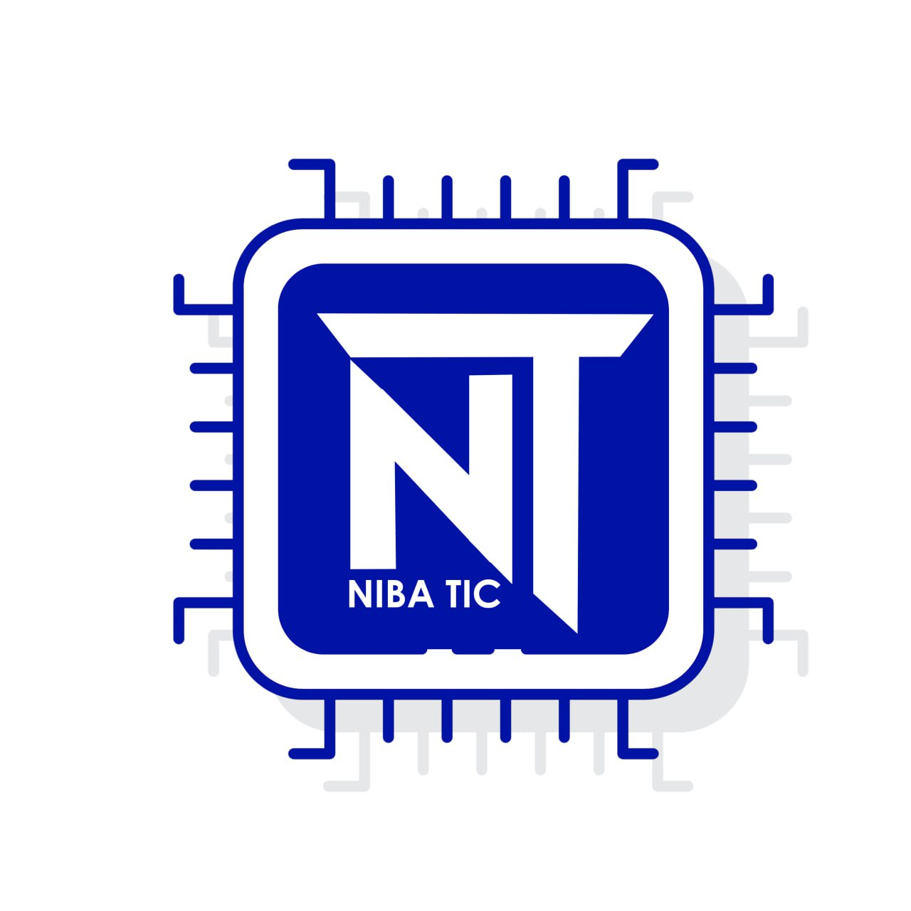

# NIBATIC



*Nibatic* est une startup qui intervient dans la recherche et l'innovation dans les secteurs du numérique  
L'entreprise évolue dans bon nombre de projet digitaux à grand public dans le secteur de **l'agronomie**, de la **santé**, de la **sécurité** et des technologies du **WEB 3**

# Projet de l'accademie NIBA SCHOOL

Le projet *Niba School* est un projet visant à développer une plateforme de **E-learning** dans le but d'organiser au mieux les formations **administratives**, **publics** et **Cursussal** de l'institut *Niba School*.

## Organisation du projet

Ce projet est organisé en **3 dossiers principaux**:

- apps

comporte l'ensemble des applications du projet qu'ils soient [frontebd](https://www.google.com/search?q=frontend&oq=frontend&gs_lcrp=EgZjaHJvbWUyBggAEEUYOdIBCTg4OTBqMGoxNagCALACAA&sourceid=chrome&ie=UTF-8) ou [backend](https://www.google.com/search?q=backend&oq=backend&gs_lcrp=EgZjaHJvbWUyBggAEEUYOTIGCAEQRRg8MgYIAhBFGDzSAQoxMTYwMGowajE1qAIAsAIA&sourceid=chrome&ie=UTF-8). Cependant ce n'est que la partie executive qui est contenu dans ce projet. C'est la partie d'exploitation où seront extraits certains outils depuis les autres dossiers principaux pour construire la partie pure;ent fonctionnelle du projet.

- libs

Ce dossier comporte la totalité des librairies et dépendances essentielles à plusieurs projets à la fois. C'est pour ainsi dire qu'il constitut le dossiers des *packages* communs.
Dans la mesure du possible la majorité des *packages* qui seront mis en export dans l'intégralite du projet seront conventionné par cette nomenclature: **@nomConventionné/nomDuPackage**

- tools

Ce dossier regroupe l'ensemble des ressources servant à tester le projet ou à organiser ce dernier. C'est le dossier qui va également paramétrer l'ensemble du projet. Il est en consquence capable de faciliter l'organisation et la planification des tầches et la prévention des erreurs éventuelles

## Le Workspace

### fichier d'organisation

Les diférents **dossiers principaux** sont ajoutés via le fichier **pnpm-workspace.yaml**.  
Le projet utilise [pnpm](https://pnpm.io/fr/) comme package ;anager pour la mise à jour et l'installation des dépendances.

Si vous ne disposez pas de *pnpm* sur votre machine vous pourrez l'installer via npm avec:

    ```bash
    npm i pmpm
    ```
notons qu'une installation globale est aussi disponible via la commande:

    ```bash
    npm i --g pnpm
    ```
Suite à cette installation vous devrez installer toutes les dépendances du projet via la commande

    ```bash
    pnpm i
    ```
Pour tous les projets node quelques commande générale vous seront disponibles directement depuis le dossier **root: /** de votre projet:

    ```bash
    pnpm -r run dev
    ```
    ```bash
    pnpm -parallel run dev
    ```
Nottez bien qu'il existe bien évidemment différentes technologies utilisées dans ce projet comme ceux signifié dans la liste dans languages vous trouverewz au **root** un fichier **Techno.json** spécifiant les les languages et les framework utilisés pour l'élaboration du projet en fonction de ces informations vous serez en mesure de mettre en place l'environnement adéquat pour lancer chacun des framework selon vos besoins. cette documentation ne se limitteran qu'a l'exploitation de l'espace de travail de **/apps**

### Pour python

Il vous faudra initialiser un environnement virtuel dans le projet *l'application* que vous souhaitez lancer avec la commande:

    ```bash:
    python -m venv <envName>
    ```
Il vous faudra ensuite lancer votre environnement virtuel via la commande:

    ```bash
    source envName/bin/activate
    ```
Vous pourrez désormais installer toutes les dépendances éssentielles à **python** via **pip**
